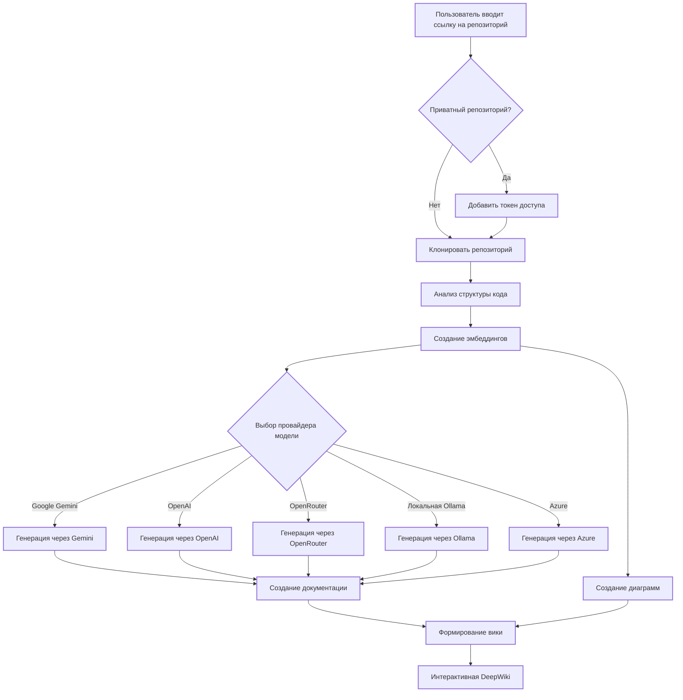

# DeepWiki-Open


**DeepWiki** — это моя собственная реализация DeepWiki, автоматически создающая красивые, интерактивные вики по любому репозиторию на GitHub, GitLab или BitBucket! Просто укажите название репозитория, и DeepWiki выполнит:

1. Анализ структуры кода
2. Генерацию полноценной документации
3. Построение визуальных диаграмм, объясняющих работу системы
4. Организацию всего в удобную и структурированную вики

[](https://buymeacoffee.com/sheing)  
[](https://tip.md/sng-asyncfunc)  
[](https://x.com/sashimikun_void)  
[](https://discord.com/invite/VQMBGR8u5v)

[English](./README.md) | [简体中文](./README.zh.md) | [繁體中文](./README.zh-tw.md) | [日本語](./README.ja.md) | [Español](./README.es.md) | [한국어](./README.kr.md) | [Tiếng Việt](./README.vi.md) | [Português Brasileiro](./README.pt-br.md) | [Français](./README.fr.md) | [Русский](./README.ru.md)

## ✨ Возможности

- **Мгновенная документация**: Превращение любого репозитория в вики за считанные секунды
- **Поддержка приватных репозиториев**: Безопасный доступ с помощью персональных токенов
- **Умный анализ**: Понимание структуры и взаимосвязей в коде с помощью ИИ
- **Красивые диаграммы**: Автоматическая генерация диаграмм Mermaid для отображения архитектуры и потоков данных
- **Простая навигация**: Интуитивный интерфейс для изучения вики
- **Функция “Спросить”**: Общение с репозиторием через ИИ, основанный на RAG, для получения точных ответов
- **DeepResearch**: Многошаговое исследование для глубокого анализа сложных тем
- **Поддержка различных провайдеров моделей**: Google Gemini, OpenAI, OpenRouter и локальные модели Ollama

## 🚀 Быстрый старт (максимально просто!)

### Вариант 1: С использованием Docker

```bash
# Клонируйте репозиторий
git clone https://github.com/AsyncFuncAI/deepwiki-open.git
cd deepwiki-open

# Создайте файл .env с вашими API-ключами
echo "GOOGLE_API_KEY=ваш_google_api_key" > .env
echo "OPENAI_API_KEY=ваш_openai_api_key" >> .env
# Необязательно: ключ OpenRouter
echo "OPENROUTER_API_KEY=ваш_openrouter_api_key" >> .env
# Необязательно: указать хост Ollama, если он не локальный (по умолчанию http://localhost:11434)
echo "OLLAMA_HOST=ваш_ollama_host" >> .env
# Необязательно: ключ и параметры Azure OpenAI
echo "AZURE_OPENAI_API_KEY=ваш_azure_api_key" >> .env
echo "AZURE_OPENAI_ENDPOINT=ваш_azure_endpoint" >> .env
echo "AZURE_OPENAI_VERSION=ваша_azure_version" >> .env
# Запуск через Docker Compose
docker-compose up
```

Подробную инструкцию по работе с Ollama и Docker см. в [Ollama Instructions](Ollama-instruction.md).

> 💡 **Где взять ключи API:**
> - [Google AI Studio](https://makersuite.google.com/app/apikey)
> - [OpenAI Platform](https://platform.openai.com/api-keys)
> - [Azure Portal](https://portal.azure.com/)

### Вариант 2: Ручная установка (рекомендуется)

#### Шаг 1: Установка ключей API

Создайте файл `.env` в корне проекта со следующим содержанием:

```
GOOGLE_API_KEY=ваш_google_api_key
OPENAI_API_KEY=ваш_openai_api_key
# Необязательно: для OpenRouter
OPENROUTER_API_KEY=ваш_openrouter_api_key
# Необязательно: для Azure OpenAI
AZURE_OPENAI_API_KEY=ваш_azure_api_key
AZURE_OPENAI_ENDPOINT=ваш_azure_endpoint
AZURE_OPENAI_VERSION=ваша_azure_version
# Необязательно: если Ollama не локальная
OLLAMA_HOST=ваш_ollama_host
```

#### Шаг 2: Запуск backend-сервера

```bash
# Установка зависимостей
pip install -r api/requirements.txt

# Запуск API
python -m api.main
```

#### Шаг 3: Запуск frontend-интерфейса

```bash
# Установка JS-зависимостей
npm install
# или
yarn install

# Запуск веб-интерфейса
npm run dev
# или
yarn dev
```

#### Шаг 4: Используйте DeepWiki!

1. Откройте [http://localhost:3000](http://localhost:3000) в браузере
2. Введите URL репозитория (например, `https://github.com/openai/codex`)
3. Для приватных репозиториев нажмите “+ Add access tokens” и введите токен
4. Нажмите “Generate Wiki” и наблюдайте за магией!

## 🔍 Как это работает

DeepWiki использует искусственный интеллект, чтобы:

1. Клонировать и проанализировать репозиторий GitHub, GitLab или Bitbucket (включая приватные — с использованием токенов)
2. Создать эмбеддинги кода для интеллектуального поиска
3. Сгенерировать документацию с учетом контекста (с помощью Google Gemini, OpenAI, OpenRouter, Azure OpenAI или локальных моделей Ollama)
4. Построить визуальные диаграммы для отображения связей в коде
5. Организовать всё в структурированную вики
6. Включить интеллектуальное взаимодействие через функцию "Спросить"
7. Обеспечить углубленный анализ через DeepResearch



## 🛠️ Структура проекта

```
deepwiki/
├── api/                  # Backend API сервер
│   ├── main.py           # Точка входа API
│   ├── api.py            # Реализация через FastAPI
│   ├── rag.py            # RAG: генерация с дополнением
│   ├── data_pipeline.py  # Утилиты обработки данных
│   └── requirements.txt  # Зависимости Python
│
├── src/                  # Клиентское приложение на Next.js
│   ├── app/              # Каталог приложения Next.js
│   │   └── page.tsx      # Главная страница приложения
│   └── components/       # React-компоненты
│       └── Mermaid.tsx   # Рендеринг диаграмм Mermaid
│
├── public/               # Статические ресурсы
├── package.json          # JS-зависимости
└── .env                  # Переменные окружения
```

## 🤖 Система выбора моделей по провайдерам

DeepWiki поддерживает гибкую систему выбора моделей от разных поставщиков:

### Поддерживаемые провайдеры и модели

- **Google**: По умолчанию `gemini-2.0-flash`, также доступны `gemini-1.5-flash`, `gemini-1.0-pro` и др.
- **OpenAI**: По умолчанию `gpt-4o`, также поддерживает `o4-mini` и другие
- **OpenRouter**: Доступ к множеству моделей через единый API (Claude, Llama, Mistral и др.)
- **Azure OpenAI**: По умолчанию `gpt-4o`, поддерживаются и другие
- **Ollama**: Локальные open-source модели, например `llama3`

### Переменные окружения

Каждому провайдеру соответствуют свои ключи:

```bash
GOOGLE_API_KEY=...         # Для моделей Google Gemini
OPENAI_API_KEY=...         # Для моделей OpenAI
OPENROUTER_API_KEY=...     # Для моделей OpenRouter
AZURE_OPENAI_API_KEY=...   # Для моделей Azure
AZURE_OPENAI_ENDPOINT=...
AZURE_OPENAI_VERSION=...

# Кастомный адрес для OpenAI API
OPENAI_BASE_URL=https://ваш-кастомный-api/v1

# Хост Ollama
OLLAMA_HOST=http://localhost:11434

# Каталог конфигурации
DEEPWIKI_CONFIG_DIR=/путь/к/конфигурации
```

### Конфигурационные файлы

DeepWiki использует JSON-файлы для настройки:

1. **`generator.json`** — конфигурация генерации текста и моделей
2. **`embedder.json`** — настройки эмбеддингов и ретривера
3. **`repo.json`** — правила обработки репозиториев

По умолчанию хранятся в `api/config/`, путь можно изменить через `DEEPWIKI_CONFIG_DIR`.

### Кастомизация для сервис-провайдеров

Функция выбора модели позволяет:

- Предоставлять выбор моделей пользователям вашей системы
- Легко адаптироваться к новым LLM без изменения кода
- Поддерживать кастомные или специализированные модели

Пользователи могут выбрать модель через интерфейс или указать свой идентификатор.

### Настройка OpenAI base_url для корпоративных клиентов

Позволяет:

- Использовать приватные API OpenAI
- Подключаться к self-hosted решениям
- Интегрироваться с совместимыми сторонними сервисами

**Скоро**: DeepWiki получит режим, в котором пользователи будут указывать свои API-ключи напрямую в запросах — удобно для корпоративных решений.

## 🧩 Использование совместимых с OpenAI моделей (например, Alibaba Qwen)

Чтобы использовать модели эмбеддингов, совместимые с OpenAI:

1. Замените `api/config/embedder.json` на `embedder_openai_compatible.json`
2. В `.env` добавьте:
```bash
OPENAI_API_KEY=ваш_ключ
OPENAI_BASE_URL=совместимый_endpoint
```

Программа автоматически подставит значения из переменных окружения.

### Логирование

DeepWiki использует стандартный `logging` из Python. Настраивается через:

| Переменная        | Описание                                      | Значение по умолчанию         |
|------------------|-----------------------------------------------|-------------------------------|
| `LOG_LEVEL`      | Уровень логов (DEBUG, INFO, WARNING и т.д.)   | INFO                          |
| `LOG_FILE_PATH`  | Путь к файлу логов                             | `api/logs/application.log`    |

Пример:
```bash
export LOG_LEVEL=DEBUG
export LOG_FILE_PATH=./debug.log
python -m api.main
```

Или через Docker Compose:
```bash
LOG_LEVEL=DEBUG LOG_FILE_PATH=./debug.log docker-compose up
```

Для постоянства логов при перезапуске контейнера `api/logs` монтируется в `./api/logs`.

Также можно указать переменные в `.env`:

```bash
LOG_LEVEL=DEBUG
LOG_FILE_PATH=./debug.log
```

И просто выполнить:

```bash
docker-compose up
```

**Безопасность логов:** в продакшене важно настроить права доступа к `api/logs`, чтобы исключить несанкционированный доступ или запись.

## 🛠️ Расширенная настройка

### Переменные окружения

| Переменная               | Назначение                                                             | Обязательно | Примечание                                                                                     |
|--------------------------|------------------------------------------------------------------------|-------------|-----------------------------------------------------------------------------------------------|
| `GOOGLE_API_KEY`         | Ключ API для Google Gemini                                             | Нет         | Только если используете модели от Google                                                      |
| `OPENAI_API_KEY`         | Ключ API для OpenAI (нужен даже для эмбеддингов)                       | Да          | Обязателен для генерации эмбеддингов                                                          |
| `OPENROUTER_API_KEY`     | Ключ API для OpenRouter                                                | Нет         | Только если используете модели OpenRouter                                                     |
| `AZURE_OPENAI_API_KEY`   | Ключ Azure OpenAI                                                      | Нет         | Только если используете Azure                                                                 |
| `AZURE_OPENAI_ENDPOINT`  | Endpoint Azure                                                         | Нет         | Только если используете Azure                                                                 |
| `AZURE_OPENAI_VERSION`   | Версия API Azure                                                       | Нет         | Только если используете Azure                                                                 |
| `OLLAMA_HOST`            | Хост Ollama (по умолчанию http://localhost:11434)                      | Нет         | Указывается при использовании внешнего сервера Ollama                                         |
| `PORT`                   | Порт API-сервера (по умолчанию 8001)                                   | Нет         | Меняйте, если frontend и backend работают на одной машине                                     |
| `SERVER_BASE_URL`        | Базовый URL для API (по умолчанию http://localhost:8001)               | Нет         |                                                                                               |
| `DEEPWIKI_AUTH_MODE`     | Включает режим авторизации (true или 1)                                | Нет         | Если включён, потребуется код из `DEEPWIKI_AUTH_CODE`                                         |
| `DEEPWIKI_AUTH_CODE`     | Секретный код для запуска генерации                                    | Нет         | Только если включён режим авторизации                                                         |

Если не используете Ollama, обязательно настройте OpenAI API ключ.

## Режим авторизации

DeepWiki может быть запущен в режиме авторизации — для генерации вики потребуется ввести секретный код. Это полезно, если вы хотите ограничить доступ к функциональности.

Для включения:

- `DEEPWIKI_AUTH_MODE=true`
- `DEEPWIKI_AUTH_CODE=секретный_код`

Это ограничивает доступ с фронтенда и защищает кэш, но не блокирует прямые вызовы API.

### Запуск через Docker

Вы можете использовать Docker:

#### Запуск контейнера

```bash
docker pull ghcr.io/asyncfuncai/deepwiki-open:latest

docker run -p 8001:8001 -p 3000:3000 \
  -e GOOGLE_API_KEY=... \
  -e OPENAI_API_KEY=... \
  -e OPENROUTER_API_KEY=... \
  -e OLLAMA_HOST=... \
  -e AZURE_OPENAI_API_KEY=... \
  -e AZURE_OPENAI_ENDPOINT=... \
  -e AZURE_OPENAI_VERSION=... \
  -v ~/.adalflow:/root/.adalflow \
  ghcr.io/asyncfuncai/deepwiki-open:latest
```

Каталог `~/.adalflow` содержит:

- Клонированные репозитории
- Эмбеддинги и индексы
- Сгенерированные кэшированные вики

#### Docker Compose

```bash
# Убедитесь, что .env заполнен
docker-compose up
```

#### Использование .env

```bash
echo "GOOGLE_API_KEY=..." > .env
...
docker run -p 8001:8001 -p 3000:3000 \
  -v $(pwd)/.env:/app/.env \
  -v ~/.adalflow:/root/.adalflow \
  ghcr.io/asyncfuncai/deepwiki-open:latest
```

#### Локальная сборка Docker-образа

```bash
git clone https://github.com/AsyncFuncAI/deepwiki-open.git
cd deepwiki-open

docker build -t deepwiki-open .

docker run -p 8001:8001 -p 3000:3000 \
  -e GOOGLE_API_KEY=... \
  -e OPENAI_API_KEY=... \
  ... \
  deepwiki-open
```

#### Самоподписанные сертификаты

1. Создайте каталог `certs` (или свой)
2. Поместите сертификаты `.crt` или `.pem`
3. Соберите образ:

```bash
docker build --build-arg CUSTOM_CERT_DIR=certs .
```

### Описание API

Сервер API:

- Клонирует и индексирует репозитории
- Реализует RAG
- Поддерживает потоковую генерацию

См. подробности в [API README](./api/README.md)

## 🔌 Интеграция с OpenRouter

Платформа [OpenRouter](https://openrouter.ai/) предоставляет доступ ко множеству моделей:

- **Много моделей**: OpenAI, Anthropic, Google, Meta и др.
- **Простая настройка**: достаточно API-ключа
- **Гибкость и экономия**: выбирайте модели по цене и производительности
- **Быстрое переключение**: без изменения кода

### Как использовать

1. Получите ключ на [OpenRouter](https://openrouter.ai/)
2. Добавьте `OPENROUTER_API_KEY=...` в `.env`
3. Активируйте в интерфейсе
4. Выберите модель (например GPT-4o, Claude 3.5, Gemini 2.0 и др.)

Подходит для:

- Тестирования разных моделей без регистрации в каждом сервисе
- Доступа к моделям в регионах с ограничениями
- Сравнения производительности
- Оптимизации затрат

## 🤖 Возможности Ask и DeepResearch

### Ask

- **Ответы по коду**: AI использует содержимое репозитория
- **RAG**: подбираются релевантные фрагменты
- **Потоковая генерация**: ответы формируются в реальном времени
- **История общения**: поддерживается контекст

### DeepResearch

Функция глубокого анализа:

- **Многошаговый подход**: AI сам исследует тему
- **Этапы исследования**:
  1. План
  2. Промежуточные результаты
  3. Итоговый вывод

Активируется переключателем "Deep Research".

## 📱 Скриншоты

  
*Основной интерфейс DeepWiki*

  
*Доступ к приватным репозиториям*

  
*DeepResearch анализирует сложные темы*

### Видео-демо

[](https://youtu.be/zGANs8US8B4)

## ❓ Решение проблем

### Проблемы с API-ключами

- **“Отсутствуют переменные окружения”** — проверьте `.env`
- **“Неверный ключ”** — уберите пробелы
- **“Ошибка OpenRouter API”** — проверьте ключ и баланс
- **“Ошибка Azure API”** — проверьте ключ, endpoint и версию

### Проблемы с подключением

- **“Нет подключения к API”** — убедитесь, что сервер запущен на 8001
- **“CORS ошибка”** — пробуйте запускать frontend и backend на одной машине

### Ошибки генерации

- **“Ошибка генерации вики”** — попробуйте меньший репозиторий
- **“Неверный формат ссылки”** — используйте корректные ссылки
- **“Нет структуры репозитория”** — проверьте токен доступа
- **“Ошибка диаграмм”** — система попытается автоматически исправить

### Универсальные советы

1. Перезапустите frontend и backend
2. Проверьте консоль браузера
3. Проверьте логи API

## 🤝 Участие

Вы можете:

- Заводить issues
- Отправлять pull requests
- Делиться идеями

## 📄 Лицензия

Проект распространяется под лицензией MIT. См. файл [LICENSE](LICENSE)

## ⭐ История звёзд

[](https://star-history.com/#AsyncFuncAI/deepwiki-open&Date)
